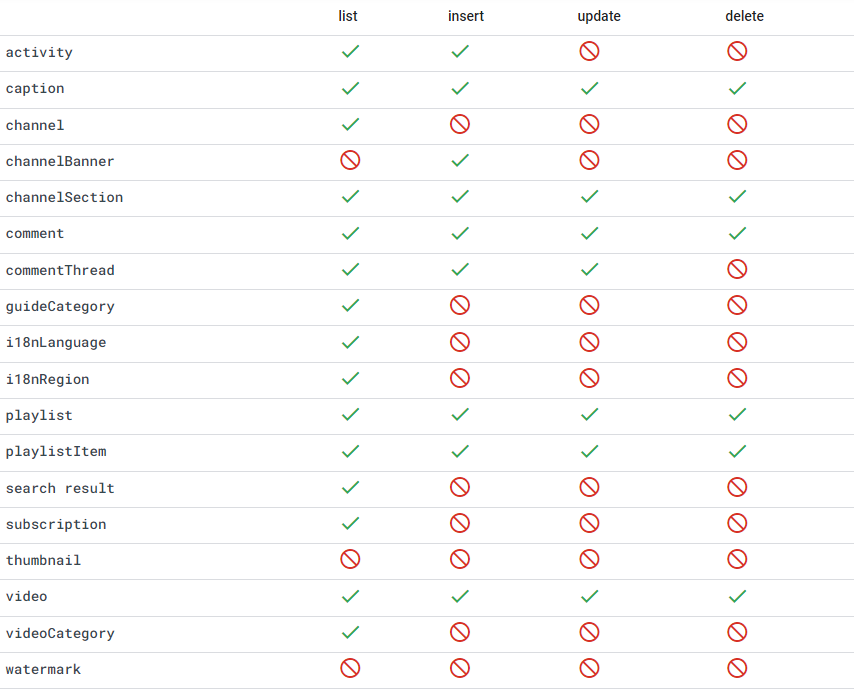
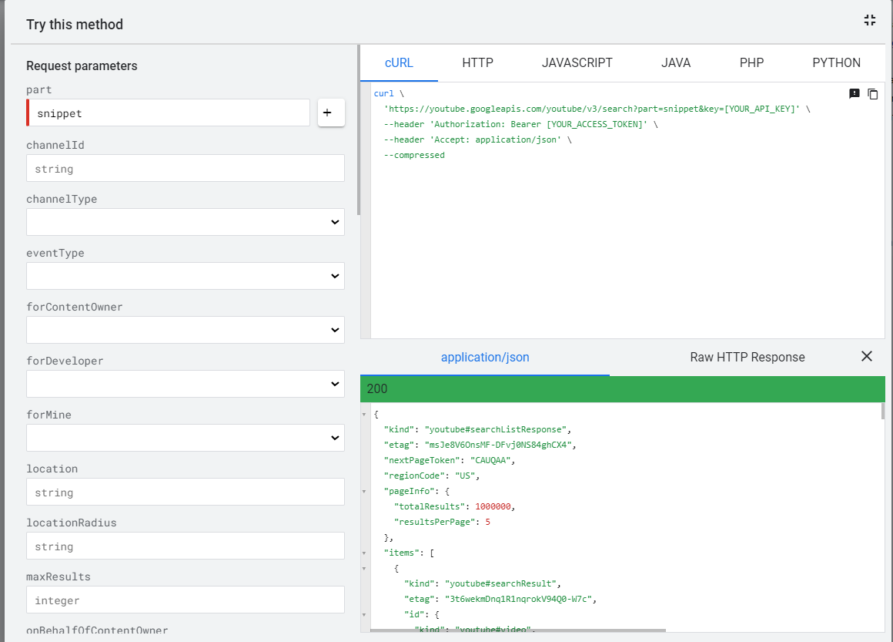

[back](/index.md)

# About
Youtube Data API adalah API yotube yang bisa digunakan untuk mengambil data video dari website youtube. Fitur yang ada di API adalah:  

# Setup
untuk memakai Youtube data API pertama-tama kalian harus punya akun [google Clound](https://console.cloud.google.com)

1. masuk ke [consol goole cloud](https://console.cloud.google.com/apis/dashboard), pilih ***enable APIS and Services***.
1. cari Youtube data APi, lalu klik *enable*

1. masuk ke youtube API untuk membuat API key. klik *cridentials* lalu klik *create credentials* dan pilih API Key.  

1. Setelah mendapatkan API key masuk ke [youtube API doc](https://developers.google.com/youtube/v3/docs/search/list?hl=id). pilih fitur yang diinginkan lalu klik cobalah / *try it*. contohnya search, isi form sesuai data yang diinginkan lalu klik execute.  

1. setelah hasilnya keluar klik show code untuk menampilkan info yang lebih lengkap
  
pilih metode yang sesuai dengan aplikasi yang akan kalian buat lalu aplikasikan ke aplikasi anda. hasih yang di dapat adalah data JSON.