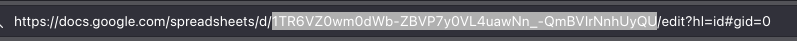

<style> 
body{ 
    background-color: #24292e; 
    color: #fff;
}
pre{
    background-color: #44494e; 
} 
</style> 

[back](./index.md)
# Google Apps Script
Apps Script adalah platform pengembangan aplikasi cepat yang mempercepat dan memudahkan pembuatan aplikasi bisnis yang terintegrasi dengan Google Workspace. [Documentasion](https://developers.google.com/apps-script/samples)

Bangun dengan Google  
API yang kaya fitur memungkinkan Anda memperluas layanan Google dan membangun aplikasi web Anda sendiri.  

Kode di Web  
Anda hanya memerlukan browser web untuk membuat Google Apps Script.

Bagikan Aplikasi Anda  
Simpan dan bagikan proyek Anda di Google Drive atau publikasikan di Toko Web Chrome.

[google Script Library](https://script.google.com/macros/library/d/1Twil1KGvSSW-G-e5U2RAncraU_p06JqRho5rmyOFN5GLBYhlf9gAuWEl/1)

## Fungsi Bawaan
1. doGet()  
   fungsi `doGet()` digunakan untuk menghendel GET request.
1. doPost()  
    fungsi `doPost()` digunakan untuk menhendel POST request

## Google Sheet
Layanan ini memungkinkan skrip untuk membuat, mengakses, dan memodifikasi file Google Sheets. Lihat juga [Panduan menyimpan data di spreadsheet](https://developers.google.com/apps-script/storing_data_spreadsheets).

Terkadang, operasi spreadsheet digabungkan bersama untuk meningkatkan performa, seperti saat melakukan beberapa panggilan ke suatu metode. Jika Anda ingin memastikan bahwa semua perubahan yang tertunda segera dilakukan, misalnya untuk menampilkan informasi pengguna saat skrip dijalankan, panggil `SpreadsheetApp.flush()`.

### mengakses Sheet
untuk mengakset google shhet dari google app script bisa menggunakan fungsi.
`SpreadsheetApp.openById(ID_sheet);` untuk mengakses spredsheet yang akan digunakan, id bisa dilihat di link google sheet.  
  
kemudian mengakses sheet yang digunakan dengan `getSheetByName(NAME_sheet);`  
```js
const sperSheet = SpreadsheetApp.openById(conf.id);
const sheet = sperSheet.getSheetByName(conf.name);
console.log(sheet);
```

### memodifikasi file sheet
1. melihat data

    Untuk mengakses data google sheet pertama-tama kita harus mengetahui range sheet baru mengambil datanya dengan `getValue()` atau `getValues()`. contoh  
    ```js
    const sperSheet = SpreadsheetApp.openById(conf.id);
    const sheet = sperSheet.getSheetByName(conf.name);
    const value = sheet.getDataRange().getValues();
    ```
1. menambah data
1. menghapus data
1. mengaupdate data

[back](./index.md)