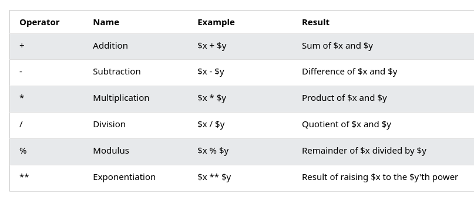
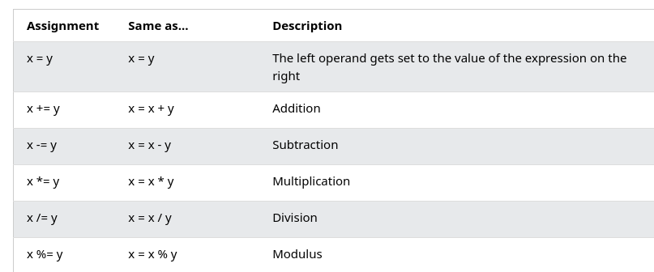
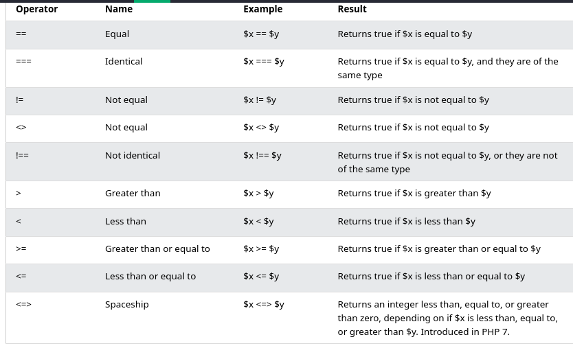
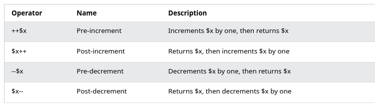
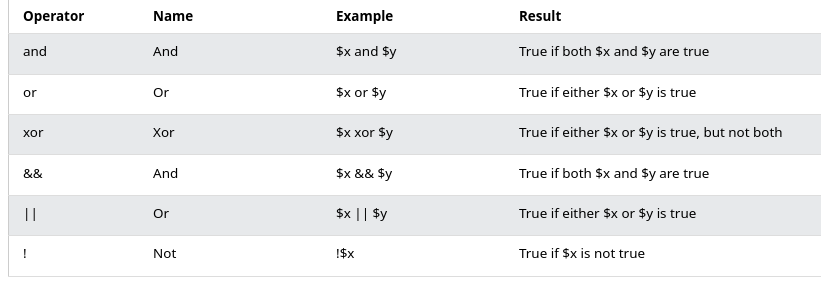
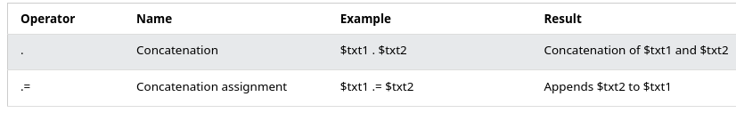
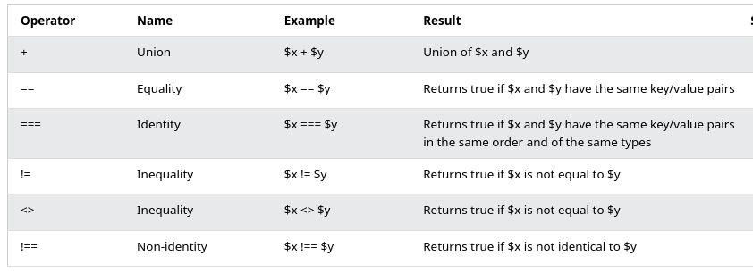
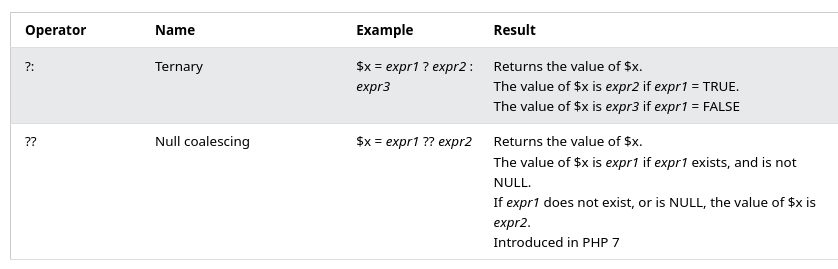

[back](../index.md)

# PHP
## About
PHP adalah singkatan dari "PHP: Hypertext Preprocessor", PHP adalah bahasa skrip sumber terbuka yang banyak digunakan, skrip PHP dijalankan di server, PHP bebas diunduh dan digunakan.  

File PHP dapat berisi teks, HTML, CSS, JavaScript, dan kode PHP, kode PHP dieksekusi di server, dan hasilnya dikembalikan ke browser sebagai HTML biasa, file PHP memiliki ekstensi ".php".  

Fungsi dari PHP: PHP dapat menghasilkan konten halaman dinamis, PHP dapat membuat, membuka, membaca, menulis, menghapus, dan menutup file di server, PHP dapat mengumpulkan data formulir, PHP dapat mengirim dan menerima cookie, PHP dapat menambah, menghapus, mengubah data di database Anda , PHP dapat digunakan untuk mengontrol akses pengguna, PHP dapat mengenkripsi data.  
Set Up PHP on Your Own PC

However, if your server does not support PHP, you must:

    install a web server
    install PHP
    install a database, such as MySQL

The official PHP website (PHP.net) has installation instructions for PHP: [PHP Manual](http://php.net/manual/en/install.php)
## Sintak Dasar
Skrip PHP dijalankan di server, dan hasil HTML biasa dikirim kembali ke browser. Skrip PHP dapat ditempatkan di mana saja dalam dokumen.

Skrip PHP dimulai dengan `<?php` dan diakhiri dengan `?>`. Ekstensi file default untuk file PHP adalah ***.php***.

File PHP biasanya berisi tag HTML, dan beberapa kode skrip PHP.

Di bawah ini, kami memiliki contoh file PHP sederhana, dengan skrip PHP yang menggunakan fungsi PHP bawaan `echo` untuk menghasilkan teks ***Hello World!*** di halaman web:
```PHP
<?php
echo "Hello World!";
?>
```
In PHP, keywords (e.g. `if, else, while, echo`, etc.), classes, functions, and user-defined functions are not case-sensitive.
## Variabel
Variabel adalah “wadah” untuk menyimpan informasi.
Dalam PHP, variabel diawali dengan tanda $, diikuti dengan nama variabel. Berbeda dengan bahasa pemrograman lainnya, PHP tidak memiliki perintah untuk mendeklarasikan suatu variabel. Itu dibuat saat Anda pertama kali memberikan nilai padanya.  

Variabel dapat memiliki nama pendek (seperti x dan y) atau nama yang lebih deskriptif (usia, nama mobil, total_volume).

Aturan untuk variabel PHP:

* Variabel diawali dengan tanda $, diikuti dengan nama variabel.
* Nama variabel harus diawali dengan huruf atau karakter garis bawah
* Nama variabel tidak boleh diawali dengan angka
* Nama variabel hanya boleh berisi karakter alfanumerik dan garis bawah (A-z, 0-9, dan _ )
* Nama variabel peka huruf besar-kecil (`$age` dan `$AGE` adalah dua variabel berbeda)

Di PHP, variabel dapat dideklarasikan dimana saja dalam skrip.

Cakupan suatu variabel adalah bagian dari skrip dimana variabel tersebut dapat direferensikan/digunakan.

PHP memiliki tiga cakupan variabel yang berbeda:
1. lokal.  
    Variabel yang dideklarasikan dalam suatu fungsi memiliki LINGKUP LOKAL dan hanya dapat diakses dalam fungsi tersebut.
1. global.  
   Variabel yang dideklarasikan di luar suatu fungsi mempunyai RUANG LINGKUP GLOBAL dan hanya dapat diakses di luar suatu fungsi.
1. statis.  
    Normally, when a function is completed/executed, all of its variables are deleted. However, sometimes we want a local variable NOT to be deleted. We need it for a further job.

Kata kunci global digunakan untuk mengakses variabel global dari dalam suatu fungsi. PHP also stores all global variables in an array called `$GLOBALS[index]`. The index holds the name of the variable. This array is also accessible from within functions and can be used to update global variables directly.
```PHP
 <?php
$x = 5; // variabel global

function myTest() {
    static $n = 0; // variabel static
    global $x; // untuk mengambil nilai variabel global x
    $y = 1; // variabel local
  echo "<p>$n. Variable x tambah y: ". $x+$y . "</p>";

}
myTest();

echo "<p>Variable x outside function is: $x</p>";
?> 
```
## Operator
Operator digunakan untuk melakukan operasi pada variabel dan nilai.
PHP membagi operator dalam kelompok berikut:  
1. Arithmetic operators

1. Assignment operators

1. Comparison operators

1. Increment/Decrement operators  

1.  Logical operators  

1.  String operators  

1.  Array operators
  
1.  Conditional assignment operators  


## Pengulangan
## Kondisi (jika..maka..)
## Array
## Object

[back](../index.md)